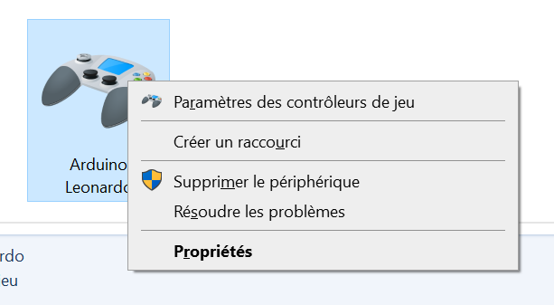
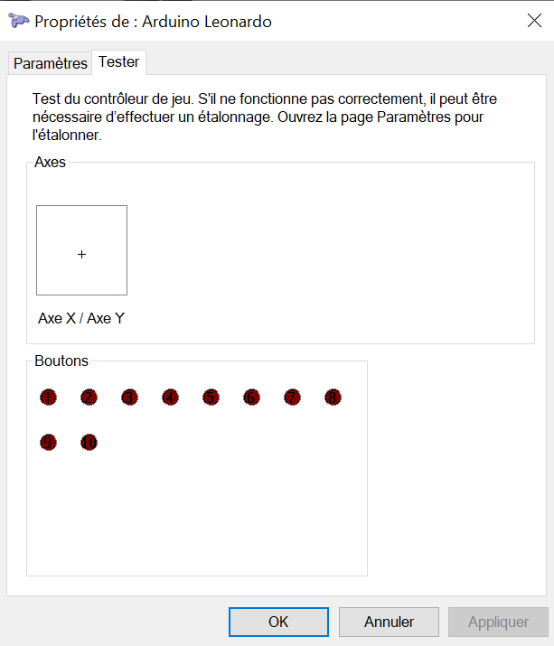
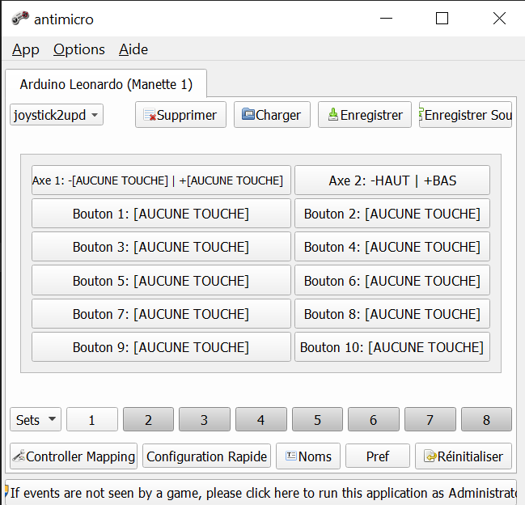

# Motion Based Game Controller

Transform your gaming experience with our DIY Motion Based Game Controller, utilizing the precision of the MPU6050 gyroscope and the versatility of an Arduino Pro Micro. This repository guides you through creating your own affordable and customizable game controller that connects seamlessly as a USB joystick to Linux, Mac, and Windows systems.

## Highlights:
- 🛠️ DIY friendly: Assemble in under 1 hour with no soldering required for basic setup.
- 💰 Cost-effective: Build your controller for approximately €5.
- 🎮 Plug-and-play: Recognized as a generic joystick on multiple operating systems.
- 🔄 Customizable mapping: Configure sensor data to joystick movements to suit your play style.

## Branches for Specialized Controllers:
- 🕹️ Giant Joystick: Check out the `GiantJoystick` branch for an enlarged controller experience.
- 🏄 Balance Board Joystick: Visit the `BalanceBoard-Xinput` branch for balance board integration.

## Quick Start:
1. Gather the hardware: Arduino Pro Micro, MPU6050 sensor, breadboard, optional push buttons, and wires.
2. Assemble the hardware: Simple breadboard setup with minimal wiring.
3. Prepare the software: Install Arduino IDE, required libraries, and example sketches from this repo.
4. Upload and play: Flash your Arduino, plug in the controller, and enjoy your games with a new level of interaction.

## Detailed Instructions & Support:
- Step-by-step building guide
- Software installation walkthrough
- Troubleshooting tips for common setup issues
- Configuration examples for joystick-to-key mapping

Ready to level up your gaming? Dive into the Motion Based Game Controller project now!

[Get Started](https://github.com/playAbilityTech/Motion-Gamepad)

**An easy-to-build DIY game controller for computers, based on the MPU6050 gyroscope & Arduino Pro Micro.** 

:video_game:

For the Giant Joystick use the Branch `GiantJoystick` : https://github.com/playAbilityTech/Motion-Gamepad/tree/GiantJoystick

For the Balance board joystick use the Branch `BalanceBoard-Xinput` : https://github.com/playAbilityTech/Motion-Gamepad/tree/BalanceBoard-Xinput
## Features

The IMU-Joystick is assembled in less than 15 minutes and costs about €5.
When connected to a computer, the board presents itself as a USB joystick. Using the MPU6050, the Arduino measures acceleration & rotation data and maps it to joystick behaviour. The precise mapping of sensor data to joystick axes/buttons can be configured in the Arduino sketch. The controller is automatically detected as a generic joystick device on Linux, Mac, and Windows, without further software:

  

## How to build an IMU-Joystick

You can put together your own IMU-Joystick in about 1-2h. Except for mounting pin headers, no soldering is required.

### 1. Get the hardware
  - [Arduino(-compatible) Pro Micro](https://www.aliexpress.com/item/New-Pro-Micro-for-arduino-ATmega32U4-5V-16MHz-Module-with-2-row-pin-header-For-Leonardo/32773740303.html), any ATmega32U4-based Arduino will do.
  - [MPU6050](https://www.aliexpress.com/item/versandkostenfrei-gy-521-mpu-6050-mpu6050-modul-3-achse-analog-Gyro-Sensoren-beschleunigungsmesser-modul/32315092057.html) (GY-521 breakout), a low-cost accelerometer + gyroscope.
  - mini-sized [breadboard](https://www.aliexpress.com/item/Mini-Breadboard-Protoboard-DIY-Kit-Universal-Transparent-Solderless-SYB-170-Breadboard-170Tie-points-Prototype-Boards-35X47MM/32717999019.html)
  - (optional) [push buttons](https://www.aliexpress.com/item/100pcs-6-6-5mm-4pin-Quality-Mini-Micro-Momentary-Tactile-Push-Button-Switch/32753141267.html)
  - some wire to make breadboard connections.

### 2. Assemble the hardware
Solder pin headers where needed; Place Pro Micro, GY-521 & wire on breadboard as follows:

  

Note that Pro Micro 8 & 9 do not need to connect to the MPU6050.

### 3. Get the software
- [Arduino IDE (>=1.6.6)](https://www.arduino.cc/en/main/software)
- external Arduino libraries:
  - [i2cdevlib](https://github.com/jrowberg/i2cdevlib)
    collection (at least [I2Cdev](https://github.com/jrowberg/i2cdevlib/tree/master/Arduino/I2Cdev) and [MPU6050](https://github.com/jrowberg/i2cdevlib/tree/master/Arduino/MPU6050)).
    
    Follow the [installation instructions on the website](https://www.i2cdevlib.com/usage), or copy the folders `i2cdevlib/Arduino/I2Cdev` and `i2cdevlib/Arduino/MPU6050` from the project repository into your Arduino [libraries directory](https://www.arduino.cc/en/hacking/libraries) (`~/Arduino/libraries/` on Linux).
  - [ArduinoJoystickLibrary (>=2.0)](https://github.com/MHeironimus/ArduinoJoystickLibrary)
  
    Copy the folder `ArduinoJoystickLibrary/Joystick` to your Arduino libraries directory.
- This repository. Copy any folder from `examples` into your Arduino directory.
    
### 4. Upload the software

Install the required libraries and upload the one of the example sketches to your Pro Micro board. Note that you might need to select Arduino Leonardo as a target board, when using the Arduino GUI.

## Usage
Plug the USB directly on the computer. (avoid USB Hub).

### On Windows 10
1. Go to  `Settings` -> `Devices`
2. `Devices and Printers` inside the `Printers and Scanners` tab
3. Right click on the controller -> `Game controller settings`

4. click on the `Properties` button

### Joystick to key Mapping
1. Download AntiMicro Software
https://github.com/AntiMicro/antimicro/releases

2. Set the Axis 2 to UP | DOWN key
or see [this example profil](assets/joystick2updown.joystick.amgp)

## Build

pin 7 -> button 3 (onboard)

pin 15 -> button 4 (connector 1 green)
pin 14 -> button 5 (connector 1 blue)
pin 16 -> button 6 (connector 2 green)
pin 10 -> button 7 (connector 2 blue)

### Important
- Keep wire short Between MPU and Arduino (may cause issue if wire are to long)
- Avoid hub USB

### Arduino IDE

1. Install external Arduino libraries:
  - [i2cdevlib](https://github.com/jrowberg/i2cdevlib) collection (at least [I2Cdev](https://github.com/jrowberg/i2cdevlib/tree/master/Arduino/I2Cdev) and [MPU6050](https://github.com/jrowberg/i2cdevlib/tree/master/Arduino/MPU6050)).

    Follow the [installation instructions on the website](https://www.i2cdevlib.com/usage), or copy the folders `i2cdevlib/Arduino/I2Cdev` and `i2cdevlib/Arduino/MPU6050` from the project repository into your Arduino [libraries directory](https://www.arduino.cc/en/hacking/libraries) (`~/Arduino/libraries/` on Linux).

  - [ArduinoJoystickLibrary (>=2.0)](https://github.com/MHeironimus/ArduinoJoystickLibrary)

    Copy the folder `ArduinoJoystickLibrary/Joystick` to your Arduino libraries directory.

2. Upload the software (select Arduino Leonardo as a target board)
